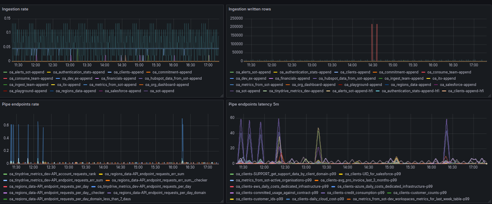

# Tinybird Organization Metrics Exporter

A **Tinybird project** designed to monitor Tinybird usage across an organization. This project uses Tinybird's **[Service Datasources](https://www.tinybird.co/docs/monitoring/organizations#organization-service-data-sources)** to aggregate and expose organizational metrics, exporting them in **Prometheus format** for easy integration with monitoring tools.

## Features

- Includes a set of **Pipes** that consolidate and process organizational metrics.  
- Exposes all key metrics through a **single Pipe Endpoint** in **Prometheus format** for streamlined monitoring.  
- Provides essential insights to help you **monitor**, **detect anomalies**, and **set up alerts** in critical areas such as:  
  - **Data ingestion**: Track the volume and frequency of ingested data.  
  - **Pipe endpoint usage**: Analyze requests and identify unusual traffic patterns.  
  - **Storage**: Monitor storage usage to optimize resources and avoid limits.  
  - **Jobs**: Keep track of the status and performance of scheduled jobs.  

## Setup


### Prerequisites

1. You must have a **[Tinybird organization](https://www.tinybird.co/docs/monitoring/organizations)**.
2. You need to be an **admin of the organization** to access [organization service datasources](https://www.tinybird.co/docs/monitoring/organizations#organization-service-data-sources).

### Steps


#### 1. Deploy to a Tinybird Workspace

<p align="center">
  <a href="https://app.tinybird.co?starter_kit=https://github.com/tinybirdco/tinybird-org-metrics-exporter">
    
  </a>
</p>


#### 2. Use the Prometheus Endpoint  
- Access the Prometheus metrics endpoint at:  

`https://api.tinybird.co/v0/pipes/organization_metrics.prometheus`


- Replace `api.tinybird.co` with your Tinybird host if the workspace is in a different region.  
- Use **admin `user@domain` Token** of an Organization admin to authenticate requests.

To scrape the Tinybird metrics endpoint, you can configure your `prometheus.yml` file as follows:


```yaml
scrape_configs:
  - job_name: tinybird_org_metrics
    scrape_interval: 15s  # Adjust the scrape interval as needed
    scheme: 'https'
    static_configs:
      - targets: 
        - 'api.tinybird.co'  # Adjust this for your region if necessary
    metrics_path: '/v0/pipes/organization_metrics.prometheus'
    bearer_token: '<admin-user-token>'  # From an Organization admin
```

In case you use a different setup such as Datadog + OpenMetrics, you can use the following configuration:

```yaml
instances:
  - prometheus_url: https://api.tinybird.co/v0/pipes/organization_metrics.prometheus?token=<admin-user-token>
    namespace: tinybird
    metrics:
      - "*"
    tags:
      - tinybird
    max_returned_metrics: 10000 # Adjust this value as needed
```

Remember to replace `api.tinybird.co` with your Tinybird host if the Workspace is in a different region.

Start monitoring your Tinybird organization effortlessly with Prometheus metrics! 🎉

### Grafana quickstart

There's a sample dashboard in Grafana that you can use to get started, see the [JSON file](./grafana/tinybird org metrics.json).

To import the dashboard, you can use the following steps:

1. Go to Grafana and click on the Dashboards menu.
2. Select **New** => **Import**.
3. Click on **Upload dashboard JSON file**.
4. Select the [JSON file](./grafana/tinybird org metrics.json) and click **Upload**.
5. Select the Prometheus datasource.
6. Click **Import**.
7. Done!

- Note: The dashboard is not perfect, it's just a quickstart to get you started.
- Note: It uses the Prometheus configuration in this repo, using as job name `tinybird_org_metrics`.



