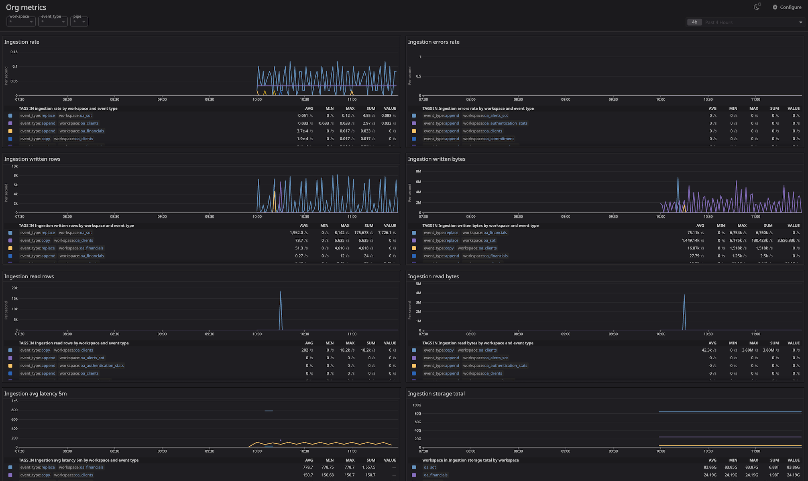

# Tinybird Organization Metrics Exporter

This project uses Tinybird's [Service Data Sources](https://www.tinybird.co/docs/monitoring/organizations#organization-service-data-sources) to aggregate and publish organizational metrics as endpoints in [Prometheus format](https://www.tinybird.co/docs/guides/integrations/consume-api-endpoints-in-prometheus-format) for quick integration with common monitoring tools.

## Features

- Includes a set of Pipes that consolidate and process organizational metrics.  
- Exposes all key metrics through a single Pipe Endpoint in Prometheus format for streamlined monitoring.  
- Provides essential insights to help you monitor your usage, detect anomalies, and set up alerts in critical areas such as:  
  - Data ingestion: Track the volume and frequency of ingested data.  
  - Pipe endpoint usage: Analyze requests and identify unusual traffic patterns.  
  - Storage: Monitor storage usage to optimize resources and avoid limits.  
  - Jobs: Keep track of the status and performance of scheduled jobs.  

## Get started

### Prerequisites

1. You must have a [Tinybird organization](https://www.tinybird.co/docs/monitoring/organizations).
2. You need to be an admin of the organization to access [organization Service Data Sources](https://www.tinybird.co/docs/monitoring/organizations#organization-service-data-sources).

### Setup

#### Deploy to a Tinybird Workspace

To deploy this template on Tinybird, run:

```bash
# select or create a new workspace
tb login

# deploy the template
tb --cloud deploy --template https://github.com/tinybirdco/tinybird-org-metrics-exporter/tree/main/tinybird
```

#### Use the Prometheus endpoint  

Access the Prometheus metrics endpoint at `https://api.tinybird.co/v0/pipes/organization_metrics.prometheus`.

- Replace `api.tinybird.co` with your Tinybird host if the workspace is in a different region. See [Regions and endpoints](https://www.tinybird.co/docs/api-reference#regions-and-endpoints).
- **Token**: for a quick check in development, you can use the pre-existing *admin `user@domain` Token* of an Organization admin to authenticate requests. But for production, the creation of a *new token* with less permissions is recommended, including these scopes:
```
  PIPES:READ:organization_metrics
  ORG_DATASOURCES:READ
```
- As of this writing, the `ORG_DATASOURCES:READ` is not available from UI, but you can create this new **prometheus_org_access** token using tokens API like this:
```shell
POST https://api.tinybird.co/v0/tokens/?name=prometheus_org_access&description=optional&scope=PIPES:READ:organization_metrics&scope=ORG_DATASOURCES:READ
```

- If you want to access all pipes, you'll need to include additional scopes:
```shell
POST https://api.tinybird.co/v0/tokens/?name=prometheus_org_access&description=optional&scope=PIPES:READ:organization_metrics&scope=PIPES:READ:ingestion&scope=PIPES:READ:storage&scope=PIPES:READ:jobs&scope=PIPES:READ:requests&scope=ORG_DATASOURCES:READ
```

To scrape the Tinybird metrics endpoint, you can configure your `prometheus.yml` file as follows:

```yaml
scrape_configs:
  - job_name: tinybird_org_metrics
    scrape_interval: 15s  # Adjust the scrape interval as needed
    scheme: 'https'
    static_configs:
      - targets: 
        - 'api.tinybird.co'  # Adjust this for your region if necessary
    metrics_path: '/v0/pipes/organization_metrics.prometheus'
    bearer_token: '<admin-user-token>'  # From an Organization admin
```

If you use a different setup, such as Datadog and OpenMetrics, you can use the following configuration:

```yaml
instances:
  - prometheus_url: https://api.tinybird.co/v0/pipes/organization_metrics.prometheus?token=<admin-user-token>
    namespace: tinybird
    metrics:
      - "*"
    tags:
      - tinybird
    max_returned_metrics: 10000 # Adjust this value as needed
```

Remember to replace `api.tinybird.co` with your Tinybird host if the Workspace is in a different region. See [Regions and endpoints](https://www.tinybird.co/docs/api-reference#regions-and-endpoints).

### Grafana quick start

We've included a sample dashboard config for Grafana to help you get started. See the [JSON file](grafana/tinybird_org_metrics.json).

Import the dashboard with the following steps:

1. Go to Grafana and click on the Dashboards menu.
2. Select **New** > **Import**.
3. Click on Upload dashboard JSON file.
4. Select the [JSON file](grafana/tinybird_org_metrics.json) and select **Upload**.
5. Select the Prometheus datasource.
6. Click **Import**.

The dashboard uses the Prometheus configuration in this repo, with the job name `tinybird_org_metrics`.


### Datadog quick start

Add the following configuration to your OpenMetrics Datadog agent `conf.yaml` file:

```yaml
instances:
  - prometheus_url: 'https://api.tinybird.co/v0/pipes/organization_metrics.prometheus?token=<admin-user-token>'
    namespace: tinybird_org_metrics
    metrics:
      - "*"
    max_returned_metrics: 700000
```

- Replace `api.tinybird.co` with your Tinybird host if the workspace is in a different region. See [Regions and endpoints](https://www.tinybird.co/docs/api-reference#regions-and-endpoints).
- Use the `user@domain` admin token of an Organization admin to authenticate requests.

We've included a sample dashboard config for Datadog that you can use to get started. See the [JSON file](datadog/tinybird_org_metrics.json).

Import the dashboard with the following steps:

1. Go to Datadog and click on the Dashboards menu.
2. Select **New Dashboard**.
3. Select **New Dashboard** in the dialog.
4. Select the settings gear icon (⚙️).
5. Select **Import Dashboard**.
6. Browse to the [JSON file](datadog/tinybird_org_metrics.json).
7. Select **Yes, replace**.



